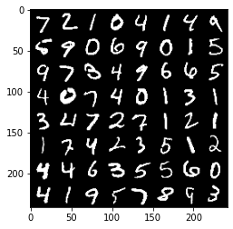
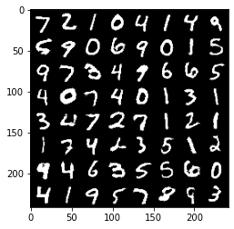

# MNIST_autoencoder

## Requirements
install anaconda to run the notebook.

Intall required packages using:
`conda install -c pytorch torchvision tqdm matplotlib`

# Example
Here is an example of original and reconstrcuted images of first 64 digits from the validation set.
Here the original images of shape (28 x 28 = 784) are encoded to (1 x 64) in latent representation.

### Original images

### Reconstructed images
